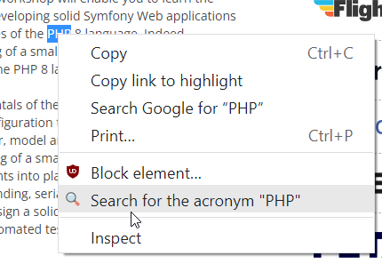
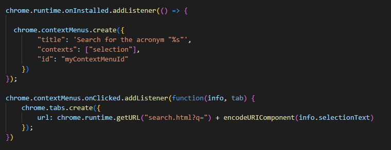
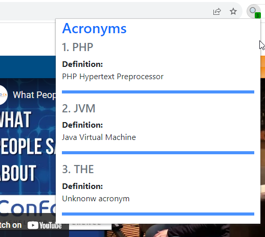
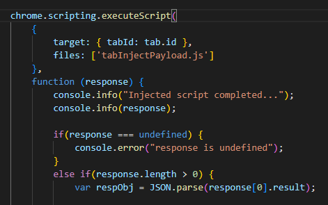
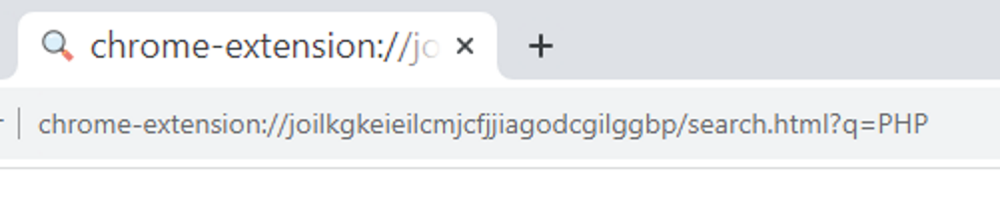
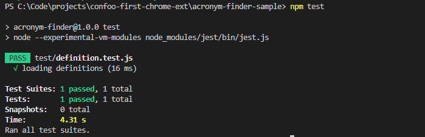

# **Developing Your First Chrome Extension**

Presented by Philippe Arteau

---

# About Me

 - Security Engineer at ServiceNow
 - Interested in application security, automation, cryptography, ...
 - Open-source developer
    - **Find Security Bugs**: Static Analysis for Java applications
    - **Burp and ZAP Plugins**: (Retire.js, CSP Auditor, Reissue Request Scripter, …)

---

# Agenda

 1. Why developed a Chrome extension?
 2. Anatomy of Chrome extension
    - `manifest.json`
    - Common components: popup, service worker, pages, context menu, ...
 3. Tooling
 4. Delivery options


--- 

<!-- _class: lead -->
# Why develop a Chrome extension?

---

# Why develop a Chrome extension?

**Non-technical reasons**

 - A great way to extended an existing web applications
    - Code repository, mail client, timesheet, etc.
 - The browser are the main software used by most "office jobs"


---
 
# Why develop a Chrome extension?

**Technical reasons**

 - You can use your favorite Frontend framework (Vue, React, Angular, ...)
 - A great complement to an existing JS CLI
    - It can share code with other JS projects.
 - Lighter than yet another Electron application

---

# Some extension ideas

 - Shortcuts for the QA team.
 - Tool to help complete timesheets with few clicks.
 - Searching feature specific to your code project.

Return on investment will differ if you have 1 user or 100+ users.

---
<!-- _class: lead -->

## 🎬 Demo

## Acronym Finder

---


<!-- _class: lead -->
# Anatomy of Chrome extension

---

## Manifest: Basic configuration

**`manifest.json`**
```json
{
    "name": "Acronym Finder",
    "description": "Simple acronym extension",
    "version": "1.0",
    "manifest_version": 3,
    "permissions": ["storage", "activeTab", "scripting","contextMenus"],
    "host_permissions": [
      "*://*/*"
    ],
    //[...]
}
```

---


## Components

 1. Service Worker _(Also called Background scripts in MV2)_
 2. Content Script
 3. Popup
 4. Context Menu
 5. Pages

---

## 1. Service worker

> A event-based script that the browser runs in the background.
> _Chrome Developers Doc._ 

 - Place where multiple event handler can be register:
   - chrome.runtime.onInstalled.addListener
   - chrome.runtime.onMessage.addListener
   - chrome.contextMenus.onClicked.addListener
 - **Isolated** from other plugins.
 - **Not directly connected** to tabs and popup context.

<!-- Refer to the demonstration for each handler -->

---

## 1. Service worker: Isolated?

Components communicate with messages.


---

## 1. Service worker: Messages

Sending a message

```js
const urlParameters = new URLSearchParams(queryParameters);

chrome.tabs.sendMessage(tabId, {
   type: "NEW",
   videoId: urlParameters.get("v"),
});
```

---

## 1. Service worker configuration


```json
{
   //[...]
   "background": {
      "service_worker": "background.js"
   },
   //[...]
}
```

---

## 3. Context menu

Context menu with option to extract the text selected.




---

## 3. Context menu




---

## 4. Popup





---

## 4. Popup (configuration)

**`manifest.json`**
```json
{
    //[...]

    "action": {
      "default_popup": "popup.html",
      "default_icon": {...}
    },
    
    //[...]
}
```

---

## 4. Popup

**`popup.js` implementation**

As an alternative to contentScript, you can inject a script on a tab.



---

## 5. Pages




---

## 5. Pages

You can get the full URL to a resource using:
```js
chrome.runtime.getURL("search.html")
```

Using a relative path from the popup will also work:
```xml
<a href="./settings.html">Settings</a>
```

---

<!-- _class: lead -->
# Build

---

## Webpack

> Resource bundler

- Allow you to use powerful JavaScript library from NPM
  - Parser, API, Data Utilities, Your own modules
- Allow you to use Bootstrap, SASS files, UI Framework
   - (Vue, React, ...)

---

## Webpack fallback

```js
module.exports = {
  //...
  resolve: {
    fallback: {
      assert: require.resolve('assert'),
      buffer: require.resolve('buffer'),
      console: require.resolve('console-browserify'),
      constants: require.resolve('constants-browserify'),
      crypto: require.resolve('crypto-browserify'),
      domain: require.resolve('domain-browser'),
      events: require.resolve('events'),
  //...
```
More info: [Webpack configuration: resolve fallback](https://webpack.js.org/configuration/resolve/#resolvefallback)

<!-- Fallbacks are a way to reuse code built with builtin NodeJS dependencies -->

---

## Testing

 - Don't forget to test your code !
 - The sample project include a demonstration of Jest integration.



---

<!-- _class: lead -->
## Conclusion


---

## Conclusion

 - Think about a potential use case
 - Start building your own extension
   - Identify the components needed
   - Look at examples
      - [Build a Chrome Extension – Course for Beginners](https://www.youtube.com/watch?v=0n809nd4Zu4)
      - [Chrome Developers Documentation](https://developer.chrome.com/docs/extensions/mv3/)
      - [The Acronym Extension from this presentation](https://github.com/h3xstream/confoo-first-chrome-ext)
 - Deploy in development mode or publish on the Chrome Web Store.

---

## There is more...

 - This presentation is just a small sample of the possibilities
 - To learn more :
   - [Chrome Developers Documentation](https://developer.chrome.com/docs/extensions/mv3/)
   - [Build a Chrome Extension – Course for Beginners](https://www.youtube.com/watch?v=0n809nd4Zu4)


<!-- This is a test -->
---


# The End !

## Social

 - Twitter [@h3xstream](https://twitter.com/h3xstream)
 - Website [https://blog.h3xstream.com](https://blog.h3xstream.com/)
